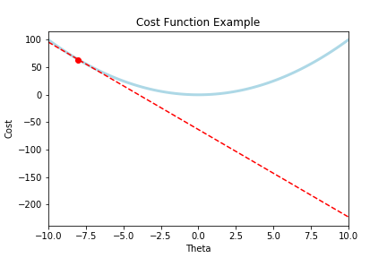

import "../../../../src/global.css"

## Achknowledements

I am currently taking Andrew Ng's [Machine Learning Course](https://www.coursera.org/learn/machine-learning) on Coursera. This blog is a summary of parts of the course.

In order to perform **Linear Regression**, we must first understand these ideas:

- Hypothesis equation
- Cost Function
- Gradient Descent
  - Learning rate

## Hypothesis equation

A hypothesis equation is like any equation we learned way back when: $f(x) = mx + b$

In this case, $f(x)$ would be our predicted value, or our **hypothesis**. $m$ and $b$ would be our **parameters**. $x$ would be one of our variables that we would use as part of our **prediction**.

Changing our notation to something more formal, we can think of $f(x)$ as our hypothesis function: $h(x)$. The parameters $m$ and $b$ could be notated as $\theta_{0}$ and $\theta_{1}$. Our variable $x$ could stay the same.

We would therefore have our hypothesis equation: $h(x) = \theta_{1}x + \theta_{0}$.

The purpose of this equation in Linear Regression is that we are trying to find the best hypothesis that most closely represents our actual data.

We are trying to see, what are the best parameters, $\theta_{0}$ and $\theta_{1}$, in the equation $h(x) = \theta_{1}x + \theta_{0}$ that would allow our $h(x)$ (the predicted value) to equal the actual value, which we could call $y$.

In order to do that we must introduce something called the...

## Cost Function

$$
J(\theta) = \frac{1}{2}(h_{\theta}(x) - y)^2
$$

- The cost function can be broken down into 4 steps:

Given a **predicted** value, which is the result of a hypothesis equation

- $h_{\theta}(x)$

and an **actual** value based off of the data:

- $y$,

1. Take the **difference** between the predicted and actual value
2. **Square** the difference
3. **Repeat 1 and 2 for all observations** and sum these values together
4. **Divide** by twice the number of observations

### Cost

This result is equal to the cost of an equation: $J(\theta)$.

You could think of cost like how much error there is between the prediction value of a given hypothesis equation and the actual value.

The goal to finding an optimal $h_{\theta}(x)$ would therefore be to **minimize the cost**.

By minimizing $J(\theta)$, we would therefore minimize how much error there is between the results of our hypothesis equation, and our actual data.

How can we minimize cost to find the optimal hypothesis equation that most accurately fits our data?

## Gradient Descent

Gradient Descent is an algorithm that can be applied in order to minimize the cost.

Intuitively, imagine we have a plot of our cost function that looks like this:

Where the red dot is the cost when our $\theta_{1} = 8$.

The goal is to get our cost $J(\theta)$ to here:

In order to do this, we must use the rate of change where we started, and iteratively move that point to the bottom.

Looking at the rate of change:

Which is that red tangent line (whose slope is our derivative), we can use that term, to move $\theta$ to the bottom.

Remember, when $J(\theta)$ is low, we would now have the optimal parameters, $\theta_{0}$ and $\theta_{1}$ within the the hypothesis equation:

- $h(x) = \theta_{1}x + \theta_{0}$.

that optimally predicts data in relation to the actual data $y$.

Here is the equation to iteratively descend our cost $J(\theta)$:

Repeat until we reach convergence (the bottom)

$
\theta_{j} := \theta_{j} - \alpha\frac{\partial}{\partial\theta_{j}}J(\theta)
$

Lets break this down:

- $ \frac{\partial}{\partial\theta_{j}}J(\theta)$ is the partial derivative of $J(\theta)$ with respect to $\theta_{j}$

  - By taking the partial derivative, we are measuring the rate of change that that specific parameter has (it's slope).

  - So $\frac{\partial}{\partial\theta_{j}}J(\theta)$ is the rate of change that specific parameter $\theta_{j}$ has,
  - this is how we get the slope of this line:
    

* $\alpha$ is the learning rate (how fast we descend).

Our descent begins every time we subtract $ - \alpha\frac{\partial}{\partial\theta_{j}}J(\theta)
$ on every parameter $\theta_{j}$ or every time we subtract our learning rate times the rate of change of every parameter on each parameter.

Our descent ends once $\theta_{j}$ reaches convergence for all $j$ parameters.

- Notice how the rate of change (the slope) of that tangent line is also zero
  - This is how Gradient Descent stops when we reach convergence!
    - Because our term: $\frac{\partial}{\partial\theta_{j}}J(\theta)$ from the equation $\theta_{j} := \theta_{j} - \alpha\frac{\partial}{\partial\theta_{j}}J(\theta)$ is now zero, and therefore there are no more updates on $\theta_{h}$

Once our descent ends, we should have the optimal parameters that best minimizes the cost function $J(\theta)$, and these parameters will go into our hypothesis function $h_{\theta}(x)$ which will now be the best fit equation.

Here is a useful quote from the course:

> The point of all this is that if we start with a guess for our hypothesis and then repeatedly apply these gradient descent equations, our hypothesis will become more and more accurate.

Once we have our hypothesis equation as accurate as it can be, we have.... a linear regression model.

**Note** this was an optimal example, there are cases where gradient descent converges towards a local optima that is not the global optima.

I also should emphasize that the visualizations for this example are for only 1 $\theta_{j}$. This process would happen for all $\theta_{j}$ parameters in our $h_\theta(x)$ equation. In this example: $\theta_{0}$ and $\theta_{1}$.

## Linear Regression

Putting it all together,

In order to perform linear regression (find the best fit line (best hypothesis) given a set of data points), we apply the gradient descent algorithm described above to find the optimal parameters for our hypothesis equation.
