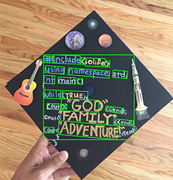

## Project Links

- Project URL: [https://shaun-jacks.shinyapps.io/visionanalyze/](https://shaun-jacks.shinyapps.io/visionanalyze/)
- Github URL: [https://github.com/shaun-jacks/shiny_vision](https://github.com/shaun-jacks/shiny_vision)

Note that the project url works most reliably with Google Chrome.

## Technologies Used

- [R](https://www.r-project.org/about.html)
- [R Shiny](https://shiny.rstudio.com/)
- [Google Cloud Vision](https://cloud.google.com/vision/)
- [R Magick](https://cran.r-project.org/web/packages/magick/vignettes/intro.html) for image processing.

## Analyses Outputs

### Facial Detection

### Landmark Detection

### Object Localization

### Text Detection

### Logo Detection

## Motivation

This project is meant to explore the use of R Shiny with cloud APIs such as Google Vision.

There are two motivations:

1. Provide other R users a template for integrating Google Vision with their R Shiny applications.
2. Apply Google Vision in an R shiny project for a health application such as:
   - emotion recognition for those who have trouble with social interactions, validation of coded image data, and many other applications.

## Acknowledgments

Thanks to [RoogleVision](https://github.com/cloudyr/RoogleVision), and the [Google Vision](https://cloud.google.com/vision/) team for making this project possible using the APIs created. Also thanks to [HackDavis19](https://hackdavis.io/), which was a vital catalyst to getting this project started when thinking of possible Machine Learning Health Applications.

Lastly, this [blog](https://github.com/stoltzmaniac/ML-Image-Processing-R/blob/master/Google%20Vision%20API/Google%20Vision%20API%20in%20R.md) by Scott Scoltzman was extremely helpful for getting started, as well as this [TensorFlow for R blog](https://blogs.rstudio.com/tensorflow/posts/2018-11-05-naming-locating-objects/). In addition, this [magick intro](https://cran.r-project.org/web/packages/magick/vignettes/intro.html) also provided much aide.
